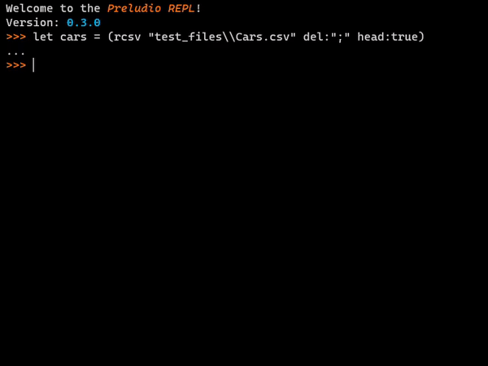

<!--  -->

# 🎭 Preludio

### A PRQL based data transformation language

Preludio is a data transformation language based on PRQL. It is a language that allows you to transform and
manipulate data in a simple and intuitive way, batteries included.

No libraries or external dependencies are required to run the language.

### Examples

Read and clean up a CSV file, then store the result in a variable called `clean`:

```
let clean = (
  rcsv "test_files\\Cars.csv" del:";" head:true
  strReplace [MPG, Displacement, Horsepower, Acceleration] old:"," new:"."
  asFlt [MPG, Displacement, Horsepower, Acceleration]
  sort [-Origin, Cylinders, -MPG]
)
```

```
let europe5Cylinders = (
  from clean
  filter Cylinders == 5 and Origin == "Europe"
)
```

Derive new columns and write the result to a CSV file:

```
(
  from clean
  derive [
    Stat = ((MPG * Cylinders * Displacement) / Horsepower * Acceleration) / Weight,
    CarOrigin = Car + " - " + Origin
  ]
  filter Stat > 1.3
  select [Car, Origin, Stat]
  wcsv "test_files\\Cars1.csv" del: "\t"
)

```

Create a new table by joining two tables:

```
let continents = (
  new [
    Continent = ["Asia", "America", "Europe"],
    Origin = ["Japan", "US", "Europe"]
  ]
)

let joined = (
  from clean
  join left continents on: [Origin]
  select [Car, Origin, Continent]
  sort [Continent, Origin]
)
```



### Features

- [x] Arithmetic and logical operators
- [x] Read and write CSV files
- [x] Derive new columns
- [x] Select columns
- [x] Filter rows
- [x] Sort rows
- [x] Join tables
- [ ] Group by and aggregate

### Installation

To run it, you need to have [Go](https://golang.org/doc/install) installed.
Once you have Go, you can clone this repository.

To run the program, you can use the following command:

```bash
go mod tidy
go run .
```

### Future Features

- [x] Move to [Gandalff](https://github.com/caerbannogwhite/preludio/tree/main/core/gandalff) library
- [ ] Add statistical functions
- [ ] Add support for Excel files
- [ ] Add support for XPT files
- [ ] Add support for SAS7BDAT files
- [ ] Add support for SPSS files
- [ ] Add date/time data types
- [ ] Database connections (SQL, MongoDB, etc.)
- [ ] VS Code extension

In case the language becomes quite successful, I will consider adding:

- [ ] Text editor/Ide (in browser and app)
- [ ] Plots (https://github.com/gonum/plot)
- [ ] Interactive plots and tables
- [ ] Integration with other languages (Python, R, etc.)
- [ ] Integration with other tools (Jupyter, etc.)
- [ ] Integration with OpenAI (https://openai.com/blog/openai-api/), ie. image to table

### Contributing

If you want to contribute to this project, you can do so by forking the repository and submitting a pull request.

### Developers

If the grammar is changed, the parser must be regenerated. To do this, run the following command:

(on Windows)

```
make.ps1
```

### Log

- **20 / 08 / 2023** After exactly one year from the first commit, Preludio is fairly stable and usable. The language is still missing a few core features (like `join` and aggregators, already supported by Gandalff), but it is already possible to perform many operations with it.
- **02 / 08 / 2023** Preludio is now using the Gandalff library for managing data.
- **21 / 03 / 2023** First publishing of the repository. Many things are still not working.
- **18 / 03 / 2023** Gandalff library: fist commit.
- **20 / 08 / 2022** Preludio: fist commit.
