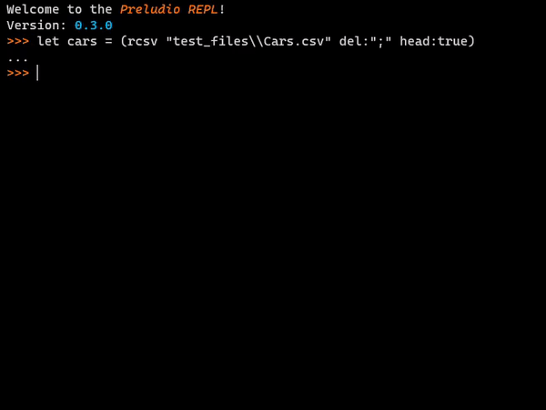

<!--  -->

# 🎭 Preludio

### A PRQL based data transformation language

> **Project status: experiment.** Preludio is a personal test bed for
> language and dataframe ideas, built on the
> [enchanter](https://github.com/caerbannogwhite/enchanter) library. It is
> not maintained for production use: features are missing, versions break
> compatibility, and bugs are likely. Use it to explore, not to ship.

Preludio is a data transformation language based on PRQL. It is a language that allows you to transform and
manipulate data in a simple and intuitive way, batteries included.

No libraries or external dependencies are required to run the language.

### Examples

Read and clean up a CSV file, then store the result in a variable called `clean`:

```
clean := (
  rcsv! p'test_files/Cars.csv' sep:';' header:true
  gsub! [MPG, Displacement, Horsepower, Acceleration] old:',' new:'.'
  as! flt [MPG, Displacement, Horsepower, Acceleration]
  sort! [-Origin, Cylinders, -MPG]
)
```

Which should print:

```
      DataFrame: 406 rows, 9 columns
    ╭────────────────────┬─────────┬───────────┬──────────────┬────────────┬────────┬──────────────┬───────┬────────╮
    │ Car                │ MPG     │ Cylinders │ Displacement │ Horsepower │ Weight │ Acceleration │ Model │ Origin │
    ├────────────────────┼─────────┼───────────┼──────────────┼────────────┼────────┼──────────────┼───────┼────────┤
    │ String             │ Float64 │ Int64     │ Float64      │ Float64    │ Int64  │ Float64      │ Int64 │ String │
    ├────────────────────┼─────────┼───────────┼──────────────┼────────────┼────────┼──────────────┼───────┼────────┤
    │ Plymouth Champ     │   39.00 │         4 │         86.0 │       64.0 │   1875 │        16.40 │    81 │ US     │
    │ Plymouth Horizo... │   38.00 │         4 │        105.0 │       63.0 │   2125 │        14.70 │    82 │ US     │
    │ Ford Fiesta        │   36.10 │         4 │         98.0 │       66.0 │   1800 │        14.40 │    78 │ US     │
    │ Dodge Charger 2.2  │   36.00 │         4 │        135.0 │       84.0 │   2370 │        13.00 │    82 │ US     │
    │ Mercury Lynx l     │   36.00 │         4 │         98.0 │       70.0 │   2125 │        17.30 │    82 │ US     │
    │ Dodge Colt Hatc... │   35.70 │         4 │         98.0 │       80.0 │   1915 │        14.40 │    79 │ US     │
    │ Plymouth Horizon 4 │   34.70 │         4 │        105.0 │       63.0 │   2215 │        14.90 │    81 │ US     │
    ┊          ⋮         ┊     ⋮    ┊      ⋮    ┊       ⋮      ┊      ⋮      ┊    ⋮   ┊       ⋮       ┊    ⋮  ┊    ⋮    ┊
    │ Volvo 264gl        │   17.00 │         6 │        163.0 │      125.0 │   3140 │        13.60 │    78 │ Europe │
    │ Mercedes-Benz 280s │   16.50 │         6 │        168.0 │      120.0 │   3820 │        16.70 │    76 │ Europe │
    │ Peugeot 604sl      │   16.20 │         6 │        163.0 │      133.0 │   3410 │        15.80 │    78 │ Europe │
    ╰────────────────────┴─────────┴───────────┴──────────────┴────────────┴────────┴──────────────┴───────┴────────╯
```

Steps chain only inside a parenthesised pipeline block: each line's result
feeds the next line. On a single line, separate the steps with `|`. A bare
statement outside a block stands alone.

```
europe5Cylinders := (
  from! clean
  filter! Cylinders == 5 and Origin == 'Europe'
)
```

Derive new columns and write the result to a CSV file:

```
result := (
  from! clean
  derive! [
    Stat = ((MPG * Cylinders * Displacement) / Horsepower * Acceleration) / Weight,
    CarOrigin = Car + ' - ' + Origin
  ]
  filter! Stat > 1.3
  select! [Car, Origin, Stat]
  wcsv! p'test_files/Cars1.csv' sep: '\t'
)
```

Create a new table by joining two tables:

```
continents := (
  new! [
    Continent = ['Asia', 'America', 'Europe'],
    Origin = ['Japan', 'US', 'Europe']
  ]
)

joined := (
  from! clean
  join! left continents on: [Origin]
  select! [Car, Origin, Continent]
  sort! [Continent, Origin]
)
```

Group rows and aggregate:

```
stats := (
  from! clean
  group! Origin
  agg! count:true mean:[MPG] max:[Horsepower]
)
```

Which should print:

```
      DataFrame: 3 rows, 4 columns
    ╭────────┬───────┬───────────┬─────────────────╮
    │ Origin │ n     │ mean(MPG) │ max(Horsepower) │
    ├────────┼───────┼───────────┼─────────────────┤
    │ String │ Int64 │ Float64   │ Float64         │
    ├────────┼───────┼───────────┼─────────────────┤
    │ Europe │    73 │     26.75 │           133.0 │
    │ Japan  │    79 │     30.45 │           132.0 │
    │ US     │   254 │     19.69 │           230.0 │
    ╰────────┴───────┴───────────┴─────────────────╯
```

<!--  -->

### The REPL

Running the program with no arguments starts the REPL. A statement runs
when you enter an empty line. `%setenv <key> <value>` changes a session
setting:

- `ENV_WARNINGS` (`true`/`false`): print warnings
- `ENV_VERBOSE` (`true`/`false`): verbose mode
- `ENV_DEBUG_LEVEL` (integer): print debug messages below this level
- `ENV_FULL_OUTPUT` (`true`/`false`): print every row of a result instead of the ten-row head and three-row tail
- `ENV_OUTPUT_WIDTH` (integer): total table width in characters, 150 by default

### Data Types

The language supports the following data types:

- `boolean` ie: `true`/`false`
- `integer` ie: `1`, `2`, `3`
- `range` ie: `1..10`, `1..10:2`
- `float` ie: `1.0`, `2e-3`, `4.5E+6`
- `string` which has some variants:
  - plain `'hello world'`, `"foo bar"`
  - raw `r'\d'`, `r"\a"`
  - path `p'c:\temp'`, `p"/home/user"`
- `regex` ie: `x'he(l){2}o'`, `x"f(o){2} bar"`
- `date` ie: `d'2021-08-20'`, `d"2021-08-20"`
- `duration` ie: `1:h`, `2:milliseconds`, `3:us`
- `na`, the null value

> Known limitation: `duration`, `date` and `range` literals parse but lose
> their type when evaluated. `1:h` becomes the integer 1 and a date stays a
> plain string. See
> [issue #22](https://github.com/caerbannogwhite/preludio/issues/22).

In addition, the language supports the following data structures:

- `list` ie: `a := [1, 2, 3]`, `b := [i = [1, 2], f = [3.0, 4.0]]`

### Operators

The language supports the following operators:

- `+` (addition)
- `-` (subtraction)
- `*` (multiplication)
- `/` (division)
- `%` (modulo)
- `^` (exponentiation)
- `and` (logical and)
- `or` (logical or)
- `not` (logical not)
- `==` (equality)
- `!=` (inequality)
- `>` (greater than)
- `>=` (greater than or equal to)
- `<` (less than)
- `<=` (less than or equal to)
- `??` (coalesce: the left side, unless it is null)

- string interpolation `f'I have {1 + 2} apples'`

### Built-in Functions

The language supports the following built-in functions:

- `from` initializes a pipeline, ie: `from! table`
- `new` creates a new dataframe, ie: `new! [a = [1, 2], b = [3, 4]]`
- `rcsv` / `wcsv` read and write CSV files, ie: `rcsv! p'file.csv' sep:',' header:true`
- `rxlsx` / `wxlsx` read and write Excel files, ie: `rxlsx! p'file.xlsx' sheet:'Sheet1'`
- `rxpt` / `wxpt` read and write XPT (SAS transport) files, ie: `rxpt! p'file.xpt'`
- `rsas` reads a SAS7BDAT file (there is no writer), ie: `rsas! p'file.sas7bdat'`
- `rjson` / `wjson` read and write record-oriented JSON files
- `rparquet` / `wparquet` read and write Parquet files
- `rarrow` / `warrow` read and write Arrow IPC (Feather) files
- `whtml` / `wmd` write HTML and Markdown tables (no readers)
- `filter` filters rows, ie: `filter! a > 1`
- `select` selects columns, ie: `select! [a, b]`
- `sort` sorts rows, ie: `sort! [a, -b]`
- `derive` adds new columns from the existing ones, ie: `derive! [c = a + b]`
- `group` / `ungroup` group rows by columns, ie: `group! [a, b]`
- `agg` aggregates a grouped dataframe, ie: `agg! count:true mean:[a] sum:[b]` (also `min`, `max`, `std`, `variance`, `median`, `any`, `all`); nulls are skipped unless `dropna:false`, which turns a group with a null into NA
- `join` joins two dataframes, ie: `join! left other on: [a]` (also `right`, `inner`, `outer`)
- `take` keeps a range of rows or picks rows by index, ie: `take! 10`, `take! 5 10` or `take! [4, 0, 0]`
- `describe` summarizes a dataframe
- `cols` lists the column names
- `as` coerces columns to a type (`bool`, `int`, `flt`, `str`), ie: `as! flt [a, b]`
- `gsub` replaces text in string columns, ie: `gsub! [a] old:',' new:'.'`

### Features

- [x] Arithmetic and logical operators
- [x] Read and write CSV files
- [x] Derive new columns
- [x] Select columns
- [x] Filter rows
- [x] Sort rows
- [x] Join tables
- [x] Group by and aggregate
- [x] Read and write Excel and XPT files, read SAS7BDAT files

### Installation

To run it, you need to have [Go](https://golang.org/doc/install) installed.
Once you have Go, you can clone this repository.

To run the program, you can use the following command:

```bash
go mod tidy
go run .
```

### Developers

If the grammar is changed, the parser must be regenerated. The files committed under `src/bytefeeder/` were generated with **ANTLR 4.11.1** (see the `Code generated ... by ANTLR 4.11.1` header in `src/bytefeeder/preludio_lexer.go`). Download that exact toolchain from https://www.antlr.org/download/antlr-4.11.1-complete.jar and put `antlr.bat` / `antlr` on `PATH`. `make.ps1` fails with an error if ANTLR is missing, instead of silently moving nothing.

(on Windows)

```
.\make.ps1
```

### New Ideas

- List can be indexed with integers, ranges, strings and regex
- Get help on functions or identifiers with `?`
- Namespaced builtins (`str.replace!`, `io.csv!`) if the flat name list grows
  past what short names can carry
